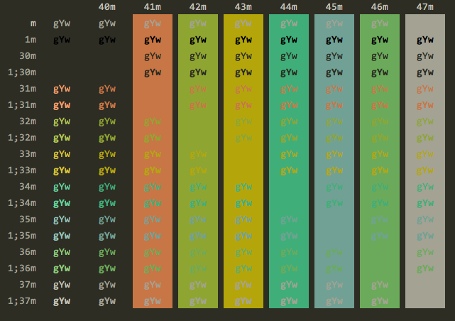

# Atelier Schemes Terminal
Color Themes for Mac OS X Terminal

### AtelierEstuary



# [Atelier Schemes](http://atelierbram.github.io/syntax-highlighting/atelier-schemes)

For the construction of these colorschemes,  [Solarized colorscheme](http://ethanschoonover.com/solarized) stood as a model, and [Base16 Builder](https://github.com/chriskempson/base16-builder) was a building tool. Like in Solarized, the colorschemes come in a light – and in a dark background version. It’s really just variations on the same idea, but each with it’s own color-value relations, interdependent on each other and their base (background-)color, giving each colorscheme it’s own character.
[Go to Demopage](http://atelierbram.github.io/syntax-highlighting/atelier-schemes)

## [Forest](http://atelierbram.github.io/syntax-highlighting/atelier-schemes/forest)
Base color for Forest is orange, and the idea is to have brownish colors for the background, not unlike a colorscheme like [“Birds of Paradise”](http://joebergantine.com/projects/color-schemes/birds-of-paradise/), but a bit muddier on the browns, less red and more greyed out, like clay.

[More info](http://atelierbram.github.io/syntax-highlighting/atelier-schemes/forest).

## [Plateau](http://atelierbram.github.io/syntax-highlighting/atelier-schemes/plateau)
Base color for Plateau is red, and here the background-colors have these chocolate brown/grey colors for the background, while the “color-wheel colors” are quite desaturated. A warm palette; no real green in here, (_see also “Cave”_).

[More info](http://atelierbram.github.io/syntax-highlighting/atelier-schemes/plateau).

## [Heath](http://atelierbram.github.io/syntax-highlighting/atelier-schemes/heath)
 Base color for Heath is magenta, and here the background-colors have these cool-red colors for the background, but then obviously toned down quite a bit.

[More info](http://atelierbram.github.io/syntax-highlighting/atelier-schemes/heath)

## [Cave](http://atelierbram.github.io/syntax-highlighting/atelier-schemes/cave)
Base color for Cave is violet, and although the colors are regularly spaced out, there is no real green in here, (_see also “Plateau”_) a “cool-warm” palette; not for the claustrophobic.

[More info](http://atelierbram.github.io/syntax-highlighting/atelier-schemes/cave)

## [Sulphurpool](http://atelierbram.github.io/syntax-highlighting/atelier-schemes/sulphurpool)
Base color for sulphurpool is purple, and here the background-colors have these grey purplish colors for the background. Darkest background-color needed not to be as desaturated as some of the warmer palettes, giving this colorscheme it’s otherworldly character. Yellow and green are close, because of avoidance of too greenish hues. In all: easy on the eye.

[More info](http://atelierbram.github.io/syntax-highlighting/atelier-schemes/sulphurpool)

## [Lakeside](http://atelierbram.github.io/syntax-highlighting/atelier-schemes/lakeside)
Base color for Lakeside is blue, which means bluish colors for the background. Coolest colorscheme of the bunch, works very well in the light-background variant, for example on a webpage (_with Prism, or Higlight.js, e.g._).  
[More info](http://atelierbram.github.io/syntax-highlighting/atelier-schemes/lakeside)

## [Savanna](http://atelierbram.github.io/syntax-highlighting/atelier-schemes/savanna)
Base color for Savanna is green, it has greenish colors for the background. “Color-wheel colors” are desaturated considerably, giving this colorscheme a rather understated appeal and, _dear I say it_, a _‘natural’_ look and feel.

[More info](http://atelierbram.github.io/syntax-highlighting/atelier-schemes/savanna)

## [Seaside](http://atelierbram.github.io/syntax-highlighting/atelier-schemes/seaside)
 Base color for Seaside is green: greenish colors for the background. Very saturated color-palette; comes popping at you.

[More info](http://atelierbram.github.io/syntax-highlighting/atelier-schemes/seaside)

## [Estuary](http://atelierbram.github.io/syntax-highlighting/atelier-schemes/estuary)
Base color for Estuary is yellow-green, no real blue, red or purple in here, (_red goes to the orange_), only the yellow/greenish colors are saturated. Colors are all very close in terms of (mid-range) tonal-contrast (‘“grey value”). A bit of a poisonous colorscheme, be aware of the crocodiles; they’re hiding in there.

[More info](http://atelierbram.github.io/syntax-highlighting/atelier-schemes/estuary)

## [Dune](http://atelierbram.github.io/syntax-highlighting/atelier-schemes/dune)
Base color for Dune is yellow, and then warm yellowish brown greyed colors for the background. A welcoming, soothing friendly but also bright, colorscheme.

[More info](http://atelierbram.github.io/syntax-highlighting/atelier-schemes/dune)

## Installation Instructions

- Clone or download this repo
- Go to `schemes/` folder
- Double click on selected `*.terminal` file. It will open a new Terminal window with that color scheme.
- Set the scheme as the default one with `Shell -> Use Settings as Default`

## Tools

### Convert iTerm 2 Color Scheme

The files of this repo were generated with a [tool](https://github.com/lysyi3m/osx-terminal-themes) made by [Emil Kashkevich](https://github.com/lysyi3m) to convert iTerm 2 color schemes into a Mac OS X Terminal schemes.

Convert by executing the swift script from the commandline:

```bash
$ ./tools/iterm2terminal.swift /path/to/my/awesome-scheme.itermcolors
```

### Generate Theme Preview

1. Load the theme in a terminal.
2. Run:

      ```bash
      $ tools/preview.sh
      ```

3. Set the font size to 14 (maybe set character spacing to 1, and line-height to 1,25).
4. Take a screenshot and put it in the `screenshots/` folder.
5. Update the `README.md` to include your new screenshot.


### Other Terminal Implementations
Support for other implementations can be found in the [output-folder of the original repo](https://github.com/atelierbram/syntax-highlighting/tree/master/atelier-schemes/output).
For iTerm2 go to [github.com/atelierbram/iTerm2_Atelier-Schemes/](https://github.com/atelierbram/iTerm2_Atelier-Schemes/).
For Hyper there is [github.com/atelierbram/base16-hyperterm](https://github.com/atelierbram/base16-hyperterm), from which one theme, SulphurpoolDark of this serie is also on npm: [npmjs.com/package/hyperterm-atelier-sulphurpool-dark](https://www.npmjs.com/package/hyperterm-atelier-sulphurpool-dark)
You may also want to checkout [these DuoTone themes for Mac OS X terminal](https://github.com/atelierbram/Base2Tone-terminal), part of [Base2Tone colorschemes](http://base2t.one).

## Resources
- [OSX Terminal Themes](https://github.com/lysyi3m/osx-terminal-themes)
- [iTerm2 Color Schemes](https://github.com/mbadolato/iTerm2-Color-Schemes)

## Credits
- [Emil Kashkevich](https://github.com/lysyi3m)
- [Mark Badolato](https://github.com/mbadolato/)
- Base16
  - [@chriskempson](https://github.com/chriskempson)
  - [@bookercodes](https://github.com/bookercodes)
  - [@aloisdg](https://github.com/aloisdg)

### License
Copyright (c) 2013 [Bram de Haan](http://atelierbramdehaan.nl/)
Released under [MIT Licence](http://atelierbram.mit-license.org)
